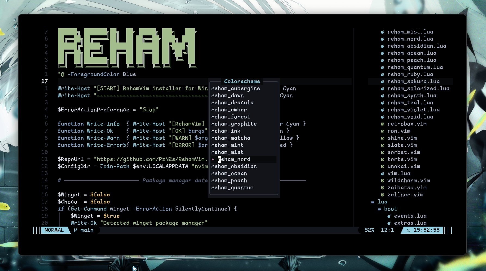

<div align="center">

# RehamVim

just my Neovim setup — built on [LazyVim](https://lazyvim.github.io).

[](https://github.com/neovim/neovim)
[](https://www.lua.org/)
[](LICENSE)
[](flake.nix)
[](https://github.com/PzN2s/RehamVim)

</div>

I wanted something fast and simple that just runs without fighting my system.
That's basically it. A Neovim config with Go, Rust, Java, Kotlin, C/C++,
TypeScript, Python and more, a few nice-to-haves, and nothing that gets in
your way.

It started as a fork of [SamoulyVim](https://github.com/sam0uly/SamoulyVim),
and since then it's been reorganized, given a wider set of languages, and
packaged as an isolated Nix binary that won't touch your system Neovim.

<div align="center">

<a href="image.png"></a>
<a href="iage.png"></a>
<br><br>
<a href="imge.png"></a>
<br><br>
<a href="Colorscheme.png"></a>

</div>

## ○ What's in it

| | Feature |
| --- | --- |
| ○ | **Languages** — Go, Rust, Java, Kotlin, C/C++, TypeScript, Python, Vue, HTML/CSS, Lua, Nix, Bash, YAML, JSON, TOML, Markdown. |
| ○ | **Isolated** — a dedicated `rehamvim` binary (Nix) so it doesn't clash with your system Neovim. |
| ○ | **The usual tools** — lazygit, telescope, treesitter, dap, lualine. |
| ○ | **Clone, open, done.** Lazy handles the rest. |

## ○ Install

You'll need Neovim ≥ 0.12, `git`, `curl`, and the compilers your LSPs need
(`gcc`, `make`, `clang`).

> [!WARNING]
> Your current `~/.config/nvim` is backed up — never destroyed.

**Linux / macOS**

```sh
bash <(curl -s https://raw.githubusercontent.com/PzN2s/RehamVim/main/install.sh)
```

**Windows (PowerShell)**

```powershell
Invoke-WebRequest https://raw.githubusercontent.com/PzN2s/RehamVim/main/install.ps1 -UseBasicParsing | Invoke-Expression
```

The installer checks the basics (`ripgrep`, `fd`, `lazygit`, `gh`) and asks
which languages you want.

> [!NOTE]
> It asks before every install, so nothing happens without you agreeing. In
> interactive terminals you get a prompt before each package download and
> clone — press `n` to skip anything. The non-interactive modes skip the
> prompts, handy for scripts.

Want to look first, or check an existing setup?

```sh
# check the system without changing anything
bash install.sh --doctor

# show what would run, execute nothing
bash install.sh --dry-run

# non-interactive install (scripts) — no prompts
bash install.sh --unattended
```

Starting it with no options asks you before every download and install.

To remove it later (config is backed up first):

```sh
bash uninstall.sh                  # remove config + data + state + cache
bash uninstall.sh --remove-langs   # ...and the language toolchains
```

**Manual**

```sh
git clone https://github.com/PzN2s/RehamVim ~/.config/nvim
nvim
```

Lazy.nvim pulls in and sets up every plugin on first launch.

## ○ Nix

There's a `flake.nix` that gives you an isolated `rehamvim` binary, so it
won't touch your system Neovim.

```sh
# try it without installing
nix run github:PzN2s/RehamVim
```

Or add it to your own flake:

```nix
{
  inputs = {
    nixpkgs.url  = "github:nixos/nixpkgs/nixos-unstable";
    rehamvim.url = "github:PzN2s/RehamVim";
  };

  home.packages = [
    inputs.rehamvim.packages.${pkgs.system}.default
  ];
}
```

> [!NOTE]
> The config lives in `/nix/store`; `rehamvim` is the entry point.

## ○ Key bindings

| Keys | Action |
| --- | --- |
| `<leader>e` | Toggle file tree |
| `<leader>f` | Find files (Telescope) |
| `<leader>u` | UI-related commands |
| `<leader>t` | Terminal |
| `<leader>T` | Tests |
| `<leader>gu` | GitHub dashboard |
| `gcc` | Toggle comment |
| `<RightMouse>` | Smart context menu |

Everything else is at `:Telescope keymaps` or `<leader>sk`.

## ○ Languages

| Language       | LSP | Debug | Test | Format |
| ---            | :---: | :---: | :---: | :---: |
| Go             | ☑ | ☑ | ☑ | ☑ |
| Rust           | ☑ | ☑ | ☑ | ☑ |
| C / C++        | ☑ | ☑ | ☑ | ☑ |
| Java           | ☑ | ○ | ○ | ☑ |
| Kotlin         | ☑ | ○ | ○ | ☑ |
| TypeScript / JS| ☑ | ○ | ○ | ☑ |
| Python         | ☑ | ○ | ○ | ☑ |
| Vue            | ☑ | ○ | ○ | ☑ |
| Lua            | ☑ | ○ | ○ | ☑ |
| Nix            | ☑ | ○ | ○ | ☑ |
| Bash / Shell   | ☑ | ○ | ○ | ○ |
| HTML / CSS     | ☑ | ○ | ○ | ☑ |
| YAML / JSON / TOML | ☑ | ○ | ○ | ☑ |
| Markdown       | ☑ | ○ | ○ | ○ |

## ○ Layout

```
~/.config/nvim
├── init.lua              # entry point
├── flake.nix             # isolated rehamvim binary
├── colors/               # 23 themes
├── lua/
│   ├── boot/             # startup wiring
│   │   ├── loader.lua    # lazy.nvim bootstrap + mods.* imports
│   │   ├── opts.lua      # neovim options
│   │   ├── events.lua    # autocmds
│   │   ├── keys.lua      # keymaps
│   │   ├── profile.lua   # Session Profiles (auto-detect / override)
│   │   └── extras.lua    # LazyVim extras
│   ├── lib/              # shared utils
│   └── mods/             # plugin specs by domain
│       ├── view/         # dashboard, tree, telescope, trouble, menu
│       ├── status/       # lualine, which-key
│       ├── edit/         # markdown, refactoring, markview
│       ├── langs/        # self-contained per-language modules
│       ├── vcs/          # lazygit, gh-dash, godoc
│       ├── tools/        # mason, cord, term, typr
│       └── debug/        # DAP
└── lazy-lock.json        # pinned plugin versions
```

## ○ Contributing

Found a bug, or want something different? Open an issue or a pull request.
Keep it small and fast — that's the whole point.

<div align="center">

<sub>Apache-2.0 · Copyright © 2026 Reham</sub>

</div>
