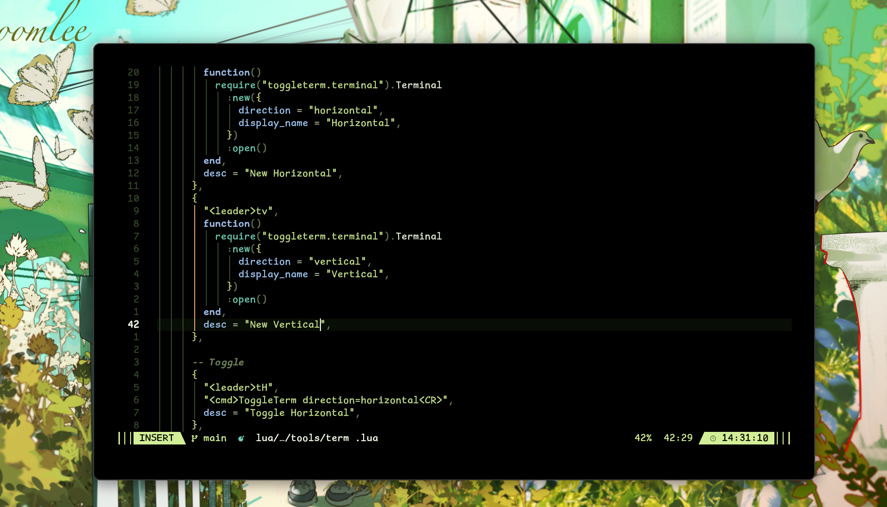
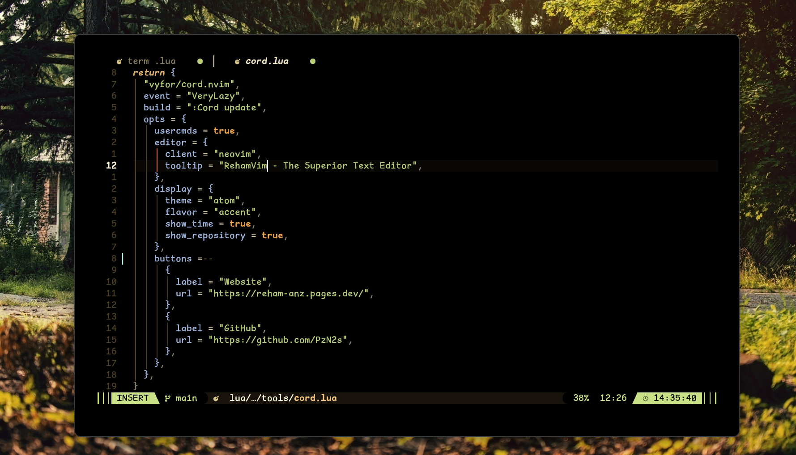
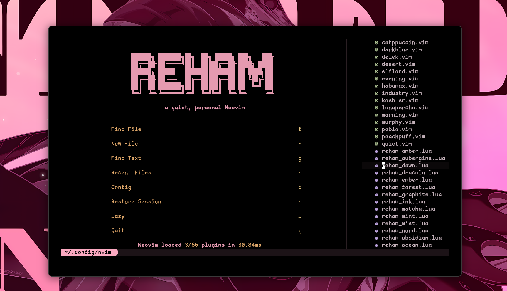

<div align="center">

# RehamVim

a quiet, personal Neovim — built on [LazyVim](https://lazyvim.github.io).

[](https://github.com/neovim/neovim)
[](https://www.lua.org/)
[](LICENSE)
[](flake.nix)
[](https://github.com/PzN2s/RehamVim)

</div>

**RehamVim** is a fast, curated Neovim configuration with one hand-built
monochrome colorscheme and deep language support. It installs in seconds,
stays out of your way, and gets out of the way of the rest of your system.

<div align="center">

<a href="image.png"></a>
<a href="iage.png"></a>
<br><br>
<a href="imge.png"></a>

</div>

## ○ Highlights

| | Feature |
| --- | --- |
| ○ | **Reham theme family** — twenty-three hand-built colorschemes, nothing third-party. |
| ○ | **Deep language support** — Go, Rust, TypeScript, Python out of the box. |
| ○ | **Isolated install** — a dedicated `rehamvim` binary (Nix), zero clashes. |
| ○ | **Curated tooling** — lazygit, telescope, treesitter, dap, lualine. |
| ○ | **Plug & play** — clone, open, done. Lazy handles the rest. |

## ○ Reham theme family

Twenty-three hand-built colorschemes share one consistent UI mapping — they differ
only in hue, so every surface, LSP diagnostic, and plugin menu stays put when you
switch. The **base family** is high-contrast and low-saturation; the **black
family** sits on a pure `#000000` background and gives text, files, and syntax
more distinct colors:

| Theme | Vibe |
| --- | --- |
| `reham_mist` | Quiet monochrome cool grey (default, matches the desktop chrome) |
| `reham_forest` | Calm sage greens, soft pine accent |
| `reham_dawn` | Warm midnight-coffee sepia, molasses accent |
| `reham_ocean` | Deep navy with sky-cyan highlights |
| `reham_ember` | Muted rose dusk on warm charcoal |
| `reham_violet` | Deep indigo with lavender highlights |
| `reham_void` | Pure black, classic blue/violet code colors |
| `reham_obsidian` | Pure black, warm retro embers |
| `reham_graphite` | Pure black, neutral teal & mint |
| `reham_quantum` | Pure black, vivid modern-IDE multicolor |
| `reham_ink` | Pure black, editorial white-forward, gold accents |
| `reham_dracula` | Pure black, classic Dracula purple/cyan/pink |
| `reham_nord` | Pure black, the beloved Nord blue-slate |
| `reham_sakura` | Pure black, cherry-blossom pinks & lilac |
| `reham_amber` | Pure black, retro amber & olive glow |
| `reham_mint` | Pure black, fresh mint & coral |
| `reham_aubergine` | Pure black, deep eggplant with iris & lilac |
| `reham_synth` | Pure black, retro synthwave neon |
| `reham_solarized` | Pure black, Solarized Dark |
| `reham_teal` | Pure black, calm teal-dominant |
| `reham_ruby` | Pure black, warm ruby-red |
| `reham_matcha` | Pure black, calm matcha-green |
| `reham_peach` | Pure black, warm apricot & peach |

Pick one any time with `<leader>uC` or `:colorscheme <name>`. Your choice is
remembered for next session. Only the Reham family actually switches colors —
third-party colorscheme plugins are removed, the ones LazyVim bundles
(tokyonight, catppuccin) are disabled, Neovim's built-in themes are shadowed in
`colors/` as silent no-ops, and every theme picker (the `<leader>uC` menu,
snacks' live-preview picker, Telescope) is filtered to `reham_*` only.
`default` (Neovim's baseline) is exempt — plugins restore to it internally.

## ○ Installation

**Prerequisites:** Neovim ≥ 0.12, `git`, `curl`, and the compilers your LSPs
need (`gcc`, `make`, `clang`).

> [!WARNING]
> Your current `~/.config/nvim` is backed up — never destroyed.

**Linux / macOS**

```sh
bash <(curl -s https://raw.githubusercontent.com/PzN2s/RehamVim/main/install.sh)
```

**Windows (PowerShell)**

```powershell
Invoke-WebRequest https://raw.githubusercontent.com/PzN2s/RehamVim/main/install.ps1 -UseBasicParsing | Invoke-Expression
```

The installer detects your package manager, installs the essentials
(`ripgrep`, `fd`, `lazygit`, `gh`), and asks which languages you want. Need to
inspect before you commit, or diagnose an existing setup?

```sh
# diagnose an existing install without changing anything
bash install.sh --doctor

# preview exactly what will run, executing nothing
bash install.sh --dry-run

# non-interactive install (CI / scripting)
bash install.sh --unattended
```

Removing RehamVim later is a one-liner (config is backed up first):

```sh
bash uninstall.sh                  # remove config + data + state + cache
bash uninstall.sh --remove-langs   # ...and installed language toolchains
```

**Manual**

```sh
git clone https://github.com/PzN2s/RehamVim ~/.config/nvim
nvim
```

Lazy.nvim fetches and configures every plugin on first launch.

## ○ Nix

Ships a `flake.nix` exposing an isolated `rehamvim` binary — no interference
with your system Neovim.

```sh
# try without installing
nix run github:PzN2s/RehamVim
```

Or add it to your flake:

```nix
{
  inputs = {
    nixpkgs.url  = "github:nixos/nixpkgs/nixos-unstable";
    rehamvim.url = "github:PzN2s/RehamVim";
  };

  home.packages = [
    inputs.rehamvim.packages.${pkgs.system}.default
  ];
}
```

> [!NOTE]
> The config lives in `/nix/store`; `rehamvim` is the entry point.

## ○ Key Bindings

| Keys | Action |
| --- | --- |
| `<leader>e` | Toggle file tree |
| `<leader>f` | Find files (Telescope) |
| `<leader>u` | UI-related commands |
| `<leader>t` | Terminal |
| `<leader>T` | Tests |
| `<leader>gu` | GitHub dashboard |
| `gcc` | Toggle comment |
| `<RightMouse>` | Smart context menu |

Full set at `:Telescope keymaps` or `<leader>sk`.

## ○ Supported Languages

| Language | LSP | Debug | Test | Format |
| --- | :---: | :---: | :---: | :---: |
| Go             | ✅ | ✅ | ✅ | ✅ |
| Rust           | ✅ | ✅ | ✅ | ✅ |
| TypeScript / JS| ✅ | — | — | ✅ |
| Python         | ✅ | — | — | ✅ |

## ○ Layout

```
~/.config/nvim
├── init.lua              # entry point
├── flake.nix             # isolated rehamvim binary
├── colors/               # Reham theme family (23 hand-built themes)
├── lua/
│   ├── boot/             # startup wiring
│   │   ├── loader.lua    # lazy.nvim bootstrap + mods.* imports
│   │   ├── opts.lua      # neovim options
│   │   ├── events.lua    # autocmds
│   │   ├── keys.lua      # keymaps
│   │   ├── profile.lua   # Session Profiles (auto-detect / override)
│   │   └── extras.lua    # LazyVim extras
│   ├── lib/              # shared utils
│   └── mods/             # plugin specs by domain
│       ├── view/         # dashboard, tree, telescope, trouble, menu
│       ├── status/       # lualine, which-key, colorscheme
│       ├── edit/         # markdown, refactoring, markview
│       ├── langs/        # self-contained per-language modules
│       ├── vcs/          # lazygit, gh-dash, godoc
│       ├── tools/        # mason, cord, term, typr
│       └── debug/        # DAP
└── lazy-lock.json        # pinned plugin versions
```

## ○ Contributing

Found a bug or want something better? Open an issue or a pull request. Keep it
minimal, keep it fast — that's the spirit of this config.

<div align="center">

<sub>Apache-2.0 · Copyright © 2026 Reham</sub>

</div>
